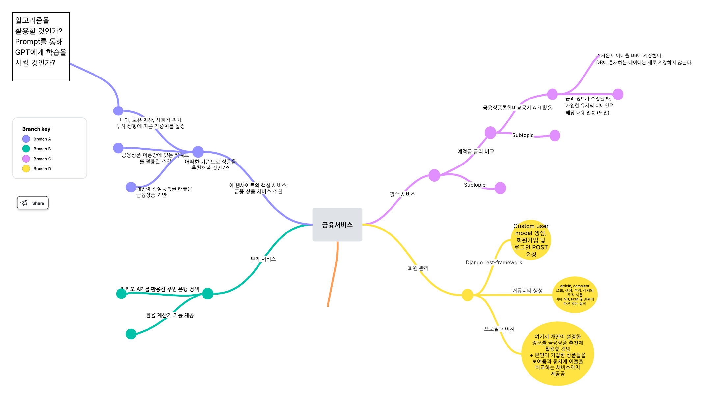
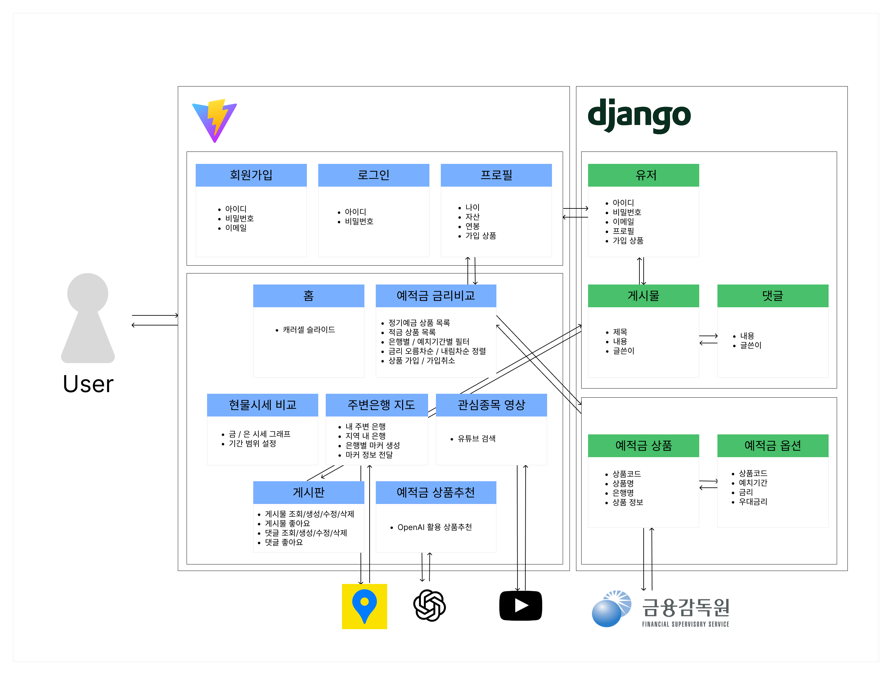
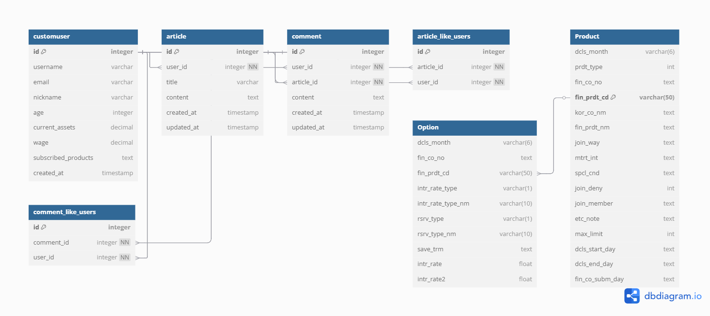

# 최종 프로젝트

## 1. 팀원 정보 및 업무 분담 내역
- 이상민:
  - 금융상품 금리 정보 DB 구축
  - 금융상품통합비교공시/Youtube/KakaoMaps API 호출 및 응답 데이터 처리
  - vue3-kakao-maps/chartjs/openai 패키지 활용 담당
- 고영우:
  - 커스텀 유저 DB 구축
  - 게시판 게시글 및 댓글 조회/생성/수정/삭제
  - 게시판 및 프로필 페이지 구축 담당

## 2. 설계 내용 및 실제 구현 정도

- 백엔드 Django에는 크게 유저 DB와 상품 금리 DB를 구축한다.
- 프론트엔드 Vite는 백엔드 REST API 서버와 통신하면서 데이터를 받아와 유저에게 필요한 기능을 제공한다.
- 또한 각 단계별로 필요한 API 호출을 적절하게 불러온다.
- 설계도에 쓰인 대로 구현은 모두 성공했다.

## 3. ERD
- 아래 이미지와 같이 DB를 설계하였다.

## 4. 금융 상품 추천 알고리즘 설명
- OpenAI API에
    - DB에 저장된 전체 예적금 상품 목록과 (유저가 이미 가입한 상품은 제외한다)
    - 유저가 설정한 나이, 자산, 연봉 정보
- 를 담아서 추천해달라는 프롬프트를 보낸다. 보다 상세한 내용은 아래에서 설명한다.
    
## 5. 서비스 대표 기능 설명
- 기본적으로 부트스트랩, 웹 폰트를 `index.html`에 적용시켜 전체적으로 사용함.
    1. 메인 페이지
    - 부트스트랩 `carousel`을 통해 자동으로 이미지가 슬라이드되면서 우리 웹사이트의 서비스를 전반적으로 보여주면서 바로 이동할 수 있도록 링크도 달아줌.
        #### 캐러셀을 활용한 레이아웃 조정시 어려움
    - 원하는 화면 레이아웃을 구성할 때 어려움이 발생했다. 메인 페이지인 만큼 화면에 꽉차게 캐러셀을 구성하고 싶었는데 하단이 비어 있는 상태로 화면이 출력되었다. 이를 해결하기 위해 `carousel img`의 `height`에 조정을 해야함을 인지하고 있었지만 어떻게 조정할지가 까다로웠다. 초반에는 `height: 100vh`를 주어 전체화면을 차지하게끔 하였다. 하지만, 이와 같이 하니 이번에는 화면 높이가 초과 출력되어 아래로 스크롤을 내려하는 문제를 맞이하였다. 화면을 천천히 뜯어본 결과 위의 `navbar` 영역 때문에 이와 같은 문제가 생김을 발견했다. Navbar의 `height`는 화면사이즈 조정에 상관없이 개발자 도구를 통해 `138px`를 차지하고 있음을 알아낸 후, `calc`함수를 사용하여 `138px` 만큼 차감된 `height`를 차지하도록 조정하니 화면이 원하는대로 출력하였다.
    2. 회원 커스터마이징
    - `dj_rest_auth.registration`을 활용해 회원가입을 구현했다. 추후 OpenAPI를 활용해 상품 추천을 할 때나 회원의 프로필 페이지에서 회원의 정보를 추가하기 위해 필드를 새롭게 정의했다.
    - 회원가입을 할 때 사용자가 가입한 상품을 backend에 저장하기 위해 `subscribed_products`라는 필드를 생성했다. 이때, 이 부분을 `ListField`로 정의하여 상품 목록을 저장하고자 했다. 새로운 필드는 정상적으로 생성되는 것을 확인했지만, 모종의 이유로 postman을 통해서 json형태의 raw data를 형식에 맞추어 회원가입을 시도할때 항상 `subscribed_products`는 null이 되는 현상을 마주치게 되었다. 애초에 `get_cleaned_data()`와 `save()` 함수가 호출되지 않았는데 이에 대한 원인을 분석하기 위해 print를 활용해 디버깅을 시도했지만, 원인을 찾는데 실패하였다. 이를 해결하기 위해 AI와 각종 사이트를 참고하여 해결하려 했지만, 결국에는 저장하는데 실패하였다.
    - 결국 다른 해결 방안으로 `subscribed_list`를  텍스트 필드로 지정하였다. 이곳은 가입한 예적금 상품의 ID를 담는데 `views.py` 함수에서 문자열을 불러와서 `.split(‘,’)` 을 통해 리스트 형태로 바꾼 후 상품을 추가/삭제한다. 저장할 때는 다시 `‘,’.join()`을 사용해 문자열로 바꾼다.
    3. 예적금 금리 비교
        #### 데이터 저장
    
    - 상품을 Product, 상품에 대한 옵션을 Option 모델로 만들고 `Product` : `Option`은 1:N으로 참조하며 FK는 상품 ID(`fin_prdt_cd`)이다.
    - 백엔드 DB에 지정한 주소로 GET을 보내면 금융상품통합비교공시 API에 정기예금과 적금 두 번의 요청을 보낸다.
    - API 응답 결과를 순회하면서, 이미 DB에 저장된 상품인지 `Product` 모델의 모든 데이터를 불러와 비교한다. 저장되지 않은 상품일 때만 `.save()`하였다.
    - 추후 프론트에서 평균 금리를 차트로 나타내기 위해 평균값을 저장한다.
    - 중첩 시리얼라이저를 이용해 Product의 데이터 안에 이 상품이 가지고 있는 개월수 옵션을 모두 담아서 응답할 수 있도록 했다.
        #### 전체 조회
    
    - 프론트에서는 바로 이 전체 상품 응답을 받아서 store에 저장한다. 정기예금과 적금을 따로 관리하기 위해 forEach로 순회하며 prdt_type을 검사해 두 개의 반응형 리스트로 나눠준다.
    - 실제 component에서는 이런 2개의 리스트를 가져온다. 검색과 조회를 자식 컴포넌트로 나눠서 구현하였고 검색 컴포넌트에는 전체 은행 목록, 조회 컴포넌트에는 조건에 따라 정기예금 혹은 적금 리스트를 props로 내려준다.
    
    - 검색에서 설정한 특정 은행/특정 예치기간 필터링, 조회에서 설정한 오름차순/내림차순 정렬은 emit을 통해 부모에 전달한다. emit에 따라 리스트를 조건에 맞게 변화시킨다.
        #### 상세 조회
    
    - 조회 목록에서 상품 이름을 누르면 modal을 통해 상세한 내용을 팝업시켰다. 이 유저가 가입한 상품 여부에 따라 가입 혹은 취소 버튼을 나타냈다.
        #### 도전과제
    
    - 백엔드 서버에 관리자 권한을 가진 사람이 edit/<상품코드> 경로로 body에 변경되는 금리 정보를 JSON 형태로 담아 POST 요청을 보내면, `views.py` 에서 전체 유저를 불러와 이 상품을 가입한 사람인지 확인 후 `django.core.mail` 내장 모듈을 활용해 변경 상황을 메일로 전송시켰다.
    - 처음에는 아무리 요청을 보내도 계속 Timeout 에러가 발생해서 방화벽 설정까지 확인해 봤는데, 알고 보니 SSAFY 내부망에서 SMTP 서버 포트를 차단한 것이 원인이었다.
    4. 현물 상품 비교
    
    - 제공받은 xlsx 데이터는 ChatGPT를 활용해 불러오기 편하도록 JSON 형태로 변환시켰다.
    - chartjs에 날짜, 금 시세, 은 시세를 각각 라벨과 데이터1, 데이터2 로 삽입시켰다.
    - 금 / 은 버튼을 누를때마다 데이터1과 데이터2를 선택해 하나만 보여주도록 하였다.
    
    - 만약 설정한 날짜 범위 내에 데이터가 없거나 범위가 잘못됐으면 차트를 출력하지 않는다.
    5. 관심 종목 정보 검색
    
    - 키워드를 입력받으면 YouTube API를 호출해 검색된 영상 목록을 받아와서 부트스트랩의 Card 컴포넌트를 활용해 출력하였다.
    - 이전 관통 프로젝트에서 검색 결과에 영상이 아닌 채널 자체가 반환되면 멈춰버리는 일이 있있기 때문에 API 응답 결과 `videoId`가 없는 결과는 걸러내었다.
    - 통일성을 주기 위해 페이지 대신 금리 정보 조회에서도 사용했던 Modal 팝업 디자인을 사용하였다. `iframe`은 부트스트랩의 `ratio` 속성을 이용해 16:9 비율을 유지하고 반응형으로 페이지의 크기에 따라 같이 조절되도록 하였다.
    6. 근처 은행 검색
    - Kakao Map API를 활용하고자 하였다.
    - 문제는 이전 관통 프로젝트처럼 `index.html`에 카카오맵을 불러오는 스크립트를 작성하고 `querySelector` 등 JS 기능을 이용해 맵을 생성하려고 하니 스크립트의 호출 시점과 DOM 요소의 생성 시점이 달라져 아예 지도를 출력하지 못하는 현상이 벌어졌다.
    - 이러한 문제점을 해결하기 위해 `vue3-kakao-maps` 패키지를 npm으로 설치하여 사용했다.
    
    - 이 패키지가 공식적으로 커스텀 오브젝트 생성까지는 지원하지 않았기 때문에 GPT와 의논한 결과, 검색 결과 마커를 생성할 때 `display:none` 속성인 오브젝트를 마커 수만큼 전부 생성하고, 특정 이벤트(마커 위로 마우스를 올렸을 때 or 마커를 클릭했을 때) `outerHTML`을 이용해서 보이게끔 한다는 방법을 사용했다. 솔직히 100% 이해했다고는 할 수 없으나, 어쨌든 포스트잇 메모처럼 더 예쁜 오브젝트를 생성했다는 점에서 타협하기로 했다.
    
    
    - `geolocation` 내장 함수를 이용해서 현재 자신의 위치가 지도에 가장 먼저 뜨게 하고, 지역을 선택하지 않으면 현재 지도를 기준으로 은행을 검색한다.
    7. 게시판
        #### 댓글 줄바꿈 반영 문제
    - Textarea에서 줄바꿈이 화면에서는 반영되지 않았다. 이를 해결하기 위해 `v-html`을 활용하였고, `content.replace()`를 쓰면 줄바꿈을 인식할 수 있음을 깨달았다.
    - 하지만 2차적으로, 댓글을 수정할 때 ` `이 그대로 `textarea`에 출력되는 문제를 마주하였고, 이를 해결하기 위해서 적재적소에 맞게 `replace`를 써야함을 깨달았다.
    - 또한, 댓글 수정을 관리할 때 쯤엔 게시판 구현 단계에서 거의 마무리 단계일때 였기에, 수 많은 component가 존재했기에, 어느 component에서 무엇을 관리해야 하는지에 대해 트래킹하기 어려웠다. 이마저도 헷갈렸기에 여기서 component를 나누는 것에 대한 중요성을 다시 한 번 느끼게 되었다.
        #### 댓글 수정 상태 관리
    - 댓글 수정 상태 관리를 할 때, 수정을 하는 중인지를 판단하는 `isEditing`과 바뀐 컨텐츠의 내용인 `editedContent`라는 변수를 명시적으로 선언하지 않았음에도 정상 동작하는 것을 확인할 수 있었다. 이는 Vue의 반응성 특성상 `v-for`로 선언된 객체에 동적 필드가 자동으로 추적되었기 때문이었다.
    
    
    - 위와 같이 게시글 및 댓글의 생성, 조회, 수정, 삭제 및 좋아요를 할 수 있다.
    8. 프로필 페이지
    - 기본 정보와 가입 상품 조회를 나누어 프로필을 볼 수 있도록 하였다.
    
    - 기본 정보에는 회원관련 모델에서 `blank=True, null=True` 필드인 닉네임, 나이, 자산, 연봉을 추가했다. 그 필드들을 serializer를 통해 get과 post를 통해 조회 및 수정을 가능하게 하였다. 각각의 필드에 대해서 저장을 가능하게 하였고, 저장이 완료되면 사용자가 인지할 수 있도록 `alert`를 주었다. 또한, 저장이 완료되면, 각 필드의 저장된 값들이 나올 수 있도록 front에서 구현하였다.
    
    - 가입 상품 조회에서는 유저와 상품정보를 관리하는 각각의 store를 불러와 유저가 가입한 상품에 대해 불러올 수 있도록 하였다. 또한, 여기서 상품명을 클릭하면 금리비교 서비스에서 구현한 것처럼 모달을 띄워 상품을 가입 또는 취소를 가능하게 하였다. 가입한 상품의 금리에 대한 바 그래프 구현은 금/은 시세 변동 때와 같이 차트 라이브러리를 쓰며 비슷한 로직을 활용하였고 `linechart`의 `type`을 `line`으로 변경하였다. 또한 가입/가입취소를 누르면 실시간으로 차트를 다시 그리도록 watch 기능을 활용했다.
    9. 금융상품 추천 알고리즘
    - 설계 단계에서는 유저 모델에 있는 나이, 자산, 연봉과 가입한 상품이 랜덤인 더미데이터를 생성하고 그에 따른 데이터 분석을 실시, 새로운 유저가 가입해서 각 항목을 작성했을 때 비슷한 유저 성향이라고 분석한 사람들이 많이 가입한 상품을 보여주는 것이 목표였다.
    - 현실적으로 시간이 부족해서 OpenAI API를 활용하는 것으로 목표를 수정하였다.
    - OpenAI를 활용한 전략은 다음과 같다.
        1. 백엔드에서 가져와 store에 저장한 전체 상품 데이터 중에서 상품명, 평균 금리, 평균 최고우대 금리, 상품코드를 텍스트화 한다.
        2. 이 중에서 유저가 이미 가입한 상품은 넣지 않는다.
        3. 요청을 보낼때 생성형 AI의 역할을 금융 전문가로 상정, 위 상품 정보와 함께 유저가 입력한 나이, 자산, 연봉 정보를 제시하고 이 사람에게 추천할 상품을 4개 뽑아달라고 프롬포트를 작성했다.
        4. 응답 결과를 원활히 활용하고 AI 응답 토큰을 절약하기 위해 ‘|’ 문자로 구분해서 ID 값만 출력해달라고 했다.
        
        
    - 응답이 성공적으로 오면 이를 처리, 활용해 상품의 상세 정보를 보여줄 수 있는 카드와 금리/우대금리 정보가 들어간 막대 차트를 만든다. 프로필 페이지의 가입한 상품 조회 탭과 유사하다.
## 6. 생성형 AI 활용부분
- 우리 프로젝트의 대표적인 생성형 AI 활용처가 바로 상품 추천 알고리즘이다.

- 이 외에도 카카오맵 API 사용 등 어려웠던 기능 구현에 많은 도움을 받았다.
- raw 코드를 주면서 프롬프트를 작성하면 응답으로 생성형 AI가 제안하는 코드는 최적화가 많이 되어 있었다. 이를 받아서 어떤 방식으로 최적화하는지 배울 수 있었다.
## 7. 기타 느낀 점
- 바로 개발에 착수하기보다는, 역시 서비스의 기능을 정의하고, 흐름을 파악한 후 설계하는 것이 정말 중요하다는 것을 뼈저리게 깨달았다. 특히 DB에 저장, 꺼낼 때 많은 시행착오가 있었다.
  - 백엔드 DB에 저장된 예적금 상품 정보를 불러올 때 axios로 요청을 보내는데 처음에는 `script` 영역에 작성했다가 재사용할 일이 많다고 여겨 `store`에 이동시키느라 시간을 반나절 정도 허비했다고 생각한다. 처음부터 꼼꼼하게 재사용 가능성을 따져가며 설계했다면 이런 일은 없었을 것이다.
  - 새로고침을 해도 로그인 세션이 만료되지 않고 계속 유지하도록 `Pinia-plugin-persistedstate` 도 적용하려고 했으나, 이미 많은 요청을 `auth Store`에 저장된 `token` 값으로 보내고 있었고 또 새로고침했을 때 프로필 정보를 저장하는 store에서 유저 정보를 불러오는 `action` 과정에서 계속 `401 Unauthorized` 에러가 발생하는 등 문제가 발생해서 적용하지 못했다. 이 또한 토큰 정보를 처음부터 로컬 스토리지 혹은 세션 스토리지에 두지 않고 기능을 구현한 탓이라고 생각한다.
  - 커스텀 유저 모델과 예적금 상품 금리 모델을 역할 분담으로 따로 만드는 것까진 좋았으나, 마지막에 서비스를 합쳐봤을 때 유저가 가입한 예적금 상품을 N:M 모델로 설정했다면 유저 모델의 가입한 상품 ID 목록인 `subscribed_list`를 굳이 `TextField`로 만들고, views.py 에서 요청을 받을 때마다 `.split(',')`과 `','.join()`을 반복하지 않아도 되고, 금리 변경 시 메일을 보낼 때 간단하게 상품 ID를 역참조하는 유저 목록을 불러오면 훨씬 더 깔끔하게 로직을 구현할 수 있었을 것이란 아쉬움이 남는다.
- 상품 추천 알고리즘은 OpenAI를 활용하는 것으로 결정하면서 필연적으로 AI 사용량에 민감한 서비스가 되었다고 생각한다. 앞으로 추가 개발을 할 수 있다면, 단시간에 너무 많은 요청을 보내버리면 비용 문제가 상당할 것이니 한 번 AI 추천을 받은 사용자는 이 추천 데이터를 DB에 저장해서 일정 시간이 경과하기 전까지는 저장한 추천 상품을 계속 보여주는 식으로 구현하면 어떨까 생각해본다.
- SSAFY 입과 후 약 3달은 Python으로, 2달은 JavaScript를 사용했는데 vite와 JavaScript가 할 수 있는 일이 많아서인지, 우리 서비스는 백엔드 Django 서버에서 데이터를 처리하는 로직보다 프론트 단에서 짠 코드와 함수가 훨씬 많았다. 현업 실무에서는 어떤 기준을 두고 어느 정도의 비율로 백엔드와 프론트엔드 처리 로직을 배분하는지 알고 싶다.